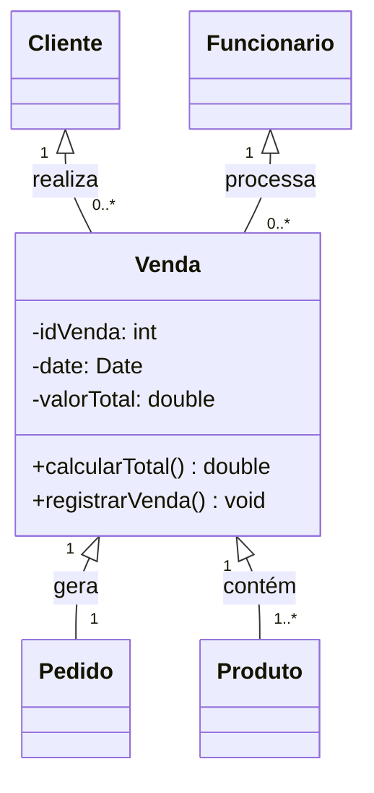

# Classe Venda

No sistema da loja de instrumentos musicais, a classe **Venda** representa a finalização de uma compra.  
Ela está diretamente ligada a um **cliente** (que realiza a compra), a um **funcionário** (que processa a venda),  
a um **pedido** (que gera a venda) e aos **produtos** incluídos.

---

## Atributos
- `idVenda : int` → Identificador único da venda.  
- `data : Date` → Data da venda.  
- `valorTotal : double` → Valor total calculado.  

## Métodos
- `calcularTotal() : double` → Retorna a soma dos preços dos produtos.  
- `registrarVenda() : void` → Registra a venda no sistema.  

---

## Diagrama UML - VENDA

