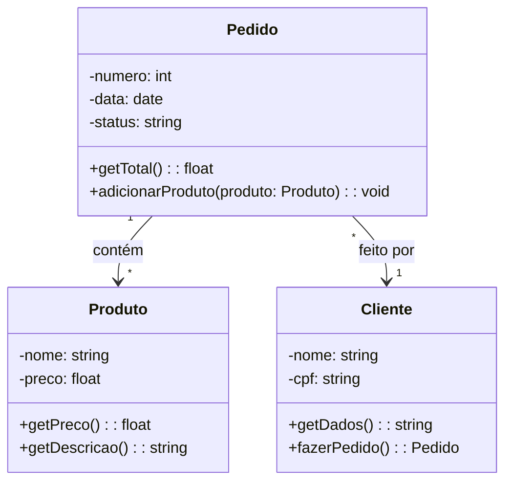

```mermaid
classDiagram
  class Pedido {
    -numero: int
    -data: date
    -status: string
    +getTotal(): float
    +adicionarProduto(produto: Produto): void
  }

  class Produto {
    -nome: string
    -preco: float
    +getPreco(): float
    +getDescricao(): string
  }

  class Cliente {
    -nome: string
    -cpf: string
    +getDados(): string
    +fazerPedido(): Pedido
  }

  Pedido "1" --> "*" Produto : contém
  Pedido "*" --> "1" Cliente : feito por
```
