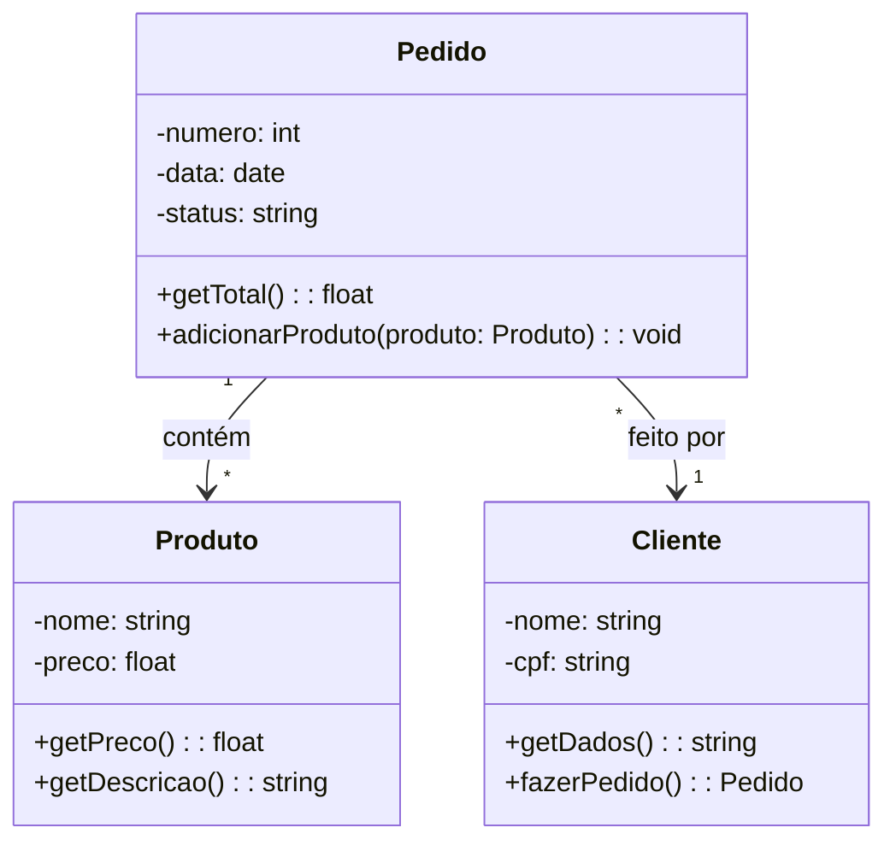

# Classe Pedido

No sistema da loja de instrumentos musicais, a classe **Pedido** representa a solicitação feita por um cliente.  
Um pedido pode conter um ou mais **produtos**, está vinculado a um **cliente** (que faz a solicitação) e serve de base para a **venda**.  
Ele é a etapa intermediária entre a escolha dos itens e a finalização da compra.  

---

## Atributos
- `numero : int` → Identificador único do pedido.  
- `data : Date` → Data em que o pedido foi realizado.  
- `status : string` → Estado atual do pedido (ex.: “aberto”, “em processamento”, “concluído”).  

## Métodos
- `getTotal() : float` → Retorna o valor total do pedido, somando os preços dos produtos.  
- `adicionarProduto(produto : Produto) : void` → Adiciona um produto à lista de itens do pedido.  

---

