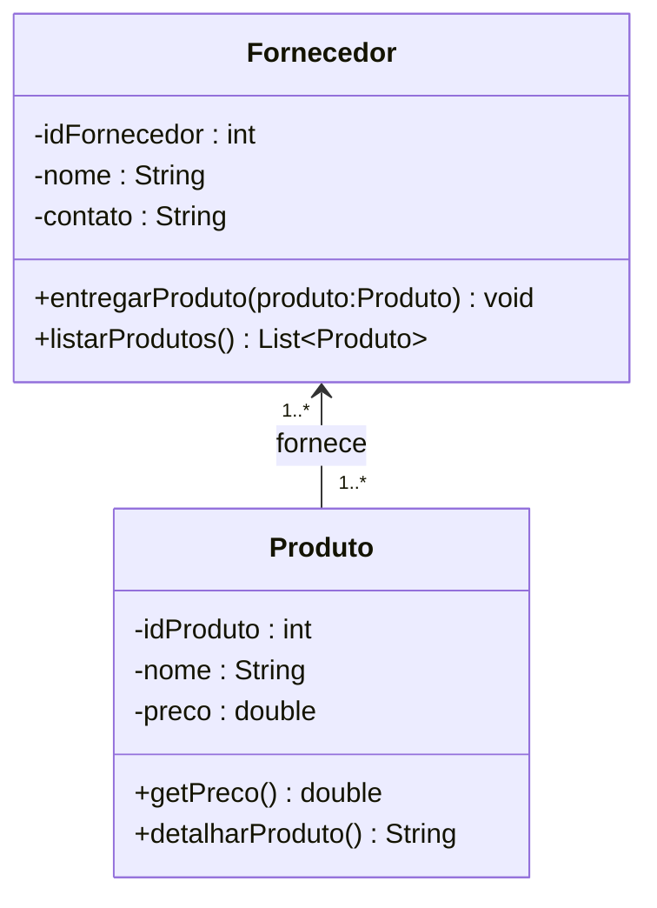

# Classe Fornecedor

## Descrição
A classe **Fornecedor** representa os parceiros comerciais que fornecem instrumentos e acessórios para a loja.  
Ela é responsável por manter a relação entre produtos e origem de fornecimento.

## Atributos
- `idFornecedor : int` → Identificador único do fornecedor.  
- `nome : String` → Nome do fornecedor.  
- `contato : String` → Informações de contato do fornecedor.  

## Métodos
- `entregarProduto(produto:Produto) : void` → Registra a entrega de um produto ao estoque da loja.  
- `listarProdutos() : List<Produto>` → Retorna a lista de produtos fornecidos.  

## Papel no Sistema
Garante o controle da origem dos produtos vendidos pela loja, permitindo consultas e gestão de estoque.

## Diagrama UML - Fornecedor

