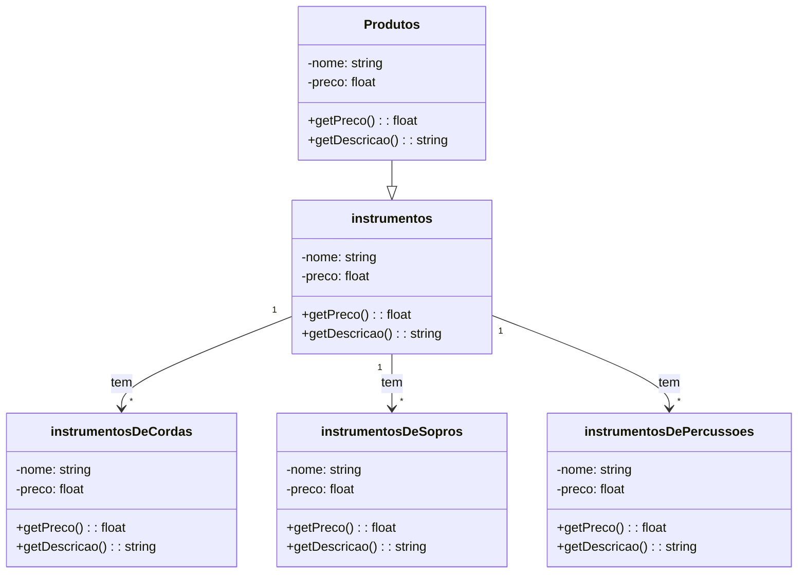

# Classe Instrumentos

No sistema da loja de instrumentos musicais, a classe **Instrumentos** representa um tipo específico de **Produto**.
Ela se divide em três categorias principais: **Cordas**, **Sopros** e **Percussão**.

---

## Atributos
### Produtos
- `nome : String` → Nome do produto.
- `preco : float` → Preço do produto.

### Instrumentos (herda de Produtos)
- `nome : String` → Nome do instrumento.  
- `preco : float` → Valor do instrumento.

### Instrumentos de Cordas (herda de Instrumentos)
- `nome : String` → Nome do instrumento de Corda.  
- `preco : float` → Valor do instrumento de Corda.

### Instrumentos de Sopros/Metais (herda de Instrumentos)
- `nome : String` → Nome do instrumento de Metais.  
- `preco : float` → Valor do instrumento de Metias.

### Instrumentos de Cordas (herda de Instrumentos)
- `nome : String` → Nome do instrumento de Percussão.
- `preco : float` → Valor do instrumento de Percussão.

---

## Métodos
- `getPreco() : float` → Retorna se o login foi válido.  
- `getDescricao() : String` → Retorna dados básicos do usuário.

