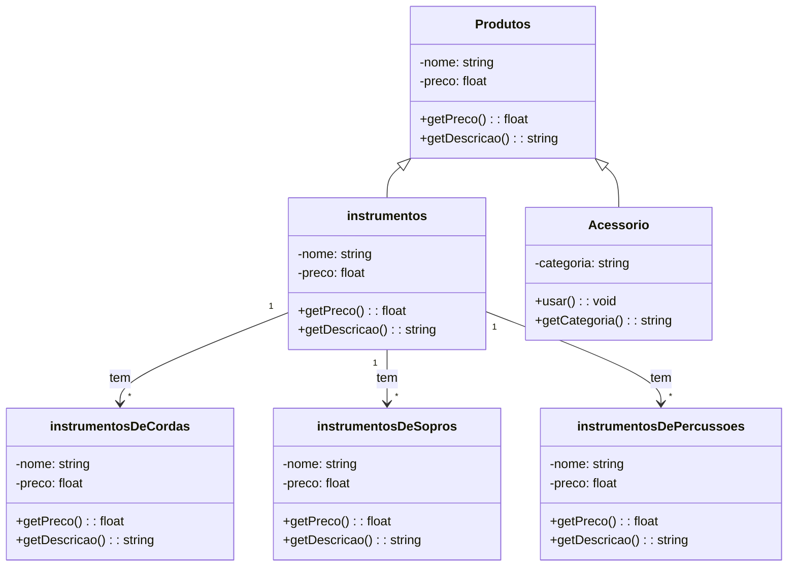

# Classe Instrumentos

No sistema da loja de instrumentos musicais, a classe **Instrumentos** representa um tipo específico de **Produto**.
Ela se divide em três categorias principais: **Cordas**, **Sopros** e **Percussão**.

---

## Atributos
### Produtos
- `nome : String` → Nome do produto.
- `preco : float` → Preço do produto.

### Instrumentos (herda de Produtos)
- `nome : String` → Nome do instrumento.  
- `preco : float` → Valor do instrumento.

### Instrumentos de Cordas (herda de Instrumentos)
- `nome : String` → Nome do instrumento de Corda.  
- `preco : float` → Valor do instrumento de Corda.

### Instrumentos de Sopros/Metais (herda de Instrumentos)
- `nome : String` → Nome do instrumento de Metais.  
- `preco : float` → Valor do instrumento de Metias.

### Instrumentos de Cordas (herda de Instrumentos)
- `nome : String` → Nome do instrumento de Percussão.
- `preco : float` → Valor do instrumento de Percussão.

## Métodos
- `getPreco() : float` → Retorna o preço do instrumento.  
- `getDescricao() : String` → Retorna a descrição (nome + preço).

### Relações no Diagrama
- `Produtos <|-- Instrumentos` → Instrumentos herdam de Produtos.
- `Instrumentos "1" --> "*" Instrumentos de Cordas : tem` → Um instrumento pode incluir vários instrumentos de cordas.
- `Instrumentos "1" --> "*" Instrumentos de Sopros/Metais : tem` → Um instrumento pode incluir vários instrumentos de sopros/metais.
- `Instrumentos "1" --> "*" Instrumentos de Percussões : tem` → Um instrumento pode incluir vários instrumentos de percussão.
---
# Classe Acessório
No sistema da loja de instrumentos musicais, a classe Acessório representa todos os itens que complementam os instrumentos, como palhetas, estojos, suportes, cabos, afinadores etc.
Ela herda de Produtos, ou seja, todo acessório também é um produto.

---

### Acessório
- `categoria: string` → Categoria do acessório (ex: Cordas, Sopros, Percussões).

### Métodos
- `usar(): void` → Executa a ação de usar o acessório.
- `getCategoria(): string` → Retorna a categoria do acessório.

---

