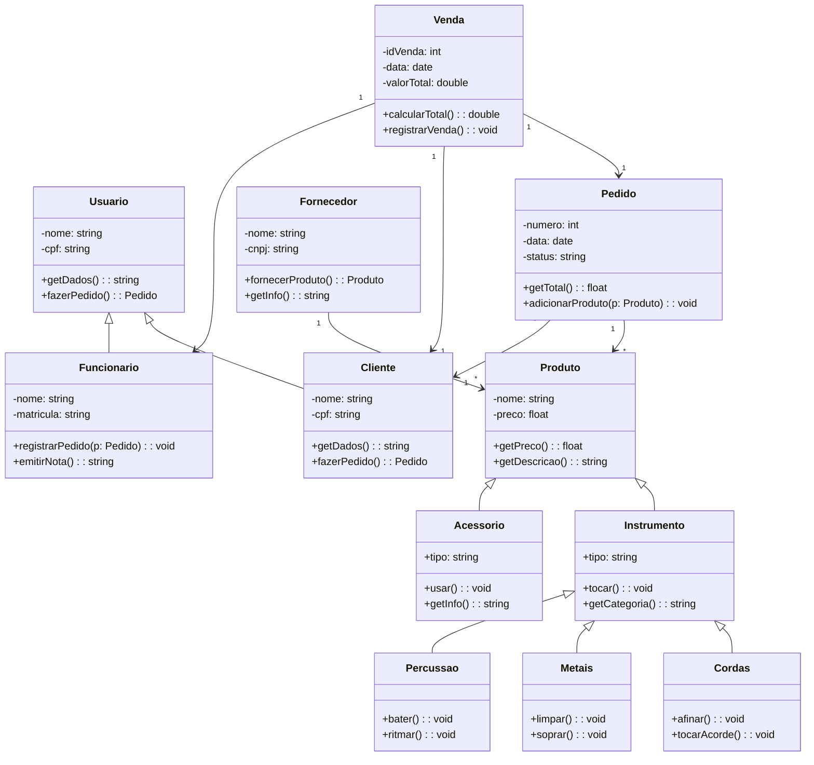

# poojavaceub
#  Loja de Instrumentos Musicais – Modelagem UML

Este projeto é a modelagem de um sistema para uma loja de instrumentos musicais.  
O objetivo é representar as entidades principais, suas relações e comportamentos, utilizando **UML de Classes com Mermaid**.

---

##  Estrutura do Projeto

O sistema foi modelado em arquivos `.md` individuais, cada um representando uma classe obrigatória:

- [Produto.md](./LucasGabriel-Instrumentos.md)  
- [Usuario.md](./Miguel-Usuário.md)  
- [Venda.md](./Duda-Venda.md)  
- [Pedido.md](./Fellipe_pedidos.md)  
- [Fornecedor.md](./Fornecedor.md)  

Cada arquivo contém:
- Descrição da classe  
- Atributos e métodos  
- Papel no sistema  
- Diagrama UML específico da classe (em Mermaid)

---
## Diagrama Geral do Sistema

